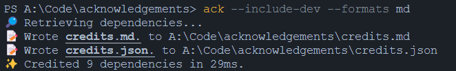
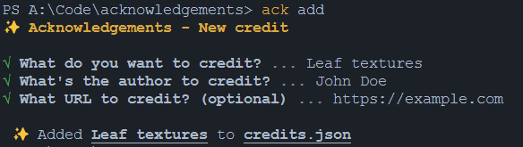

# Acknowledgements

✨ Properly credit deps and assets in your projects in a pretty way.

## About

Acknowledgments is a CLI tool that generates a JSON file with a list of all the local dependencies from `package.json`, as well as ones you add yourself, with exports to many file types (CSV, TOML, HTML, YAML and Markdown).



## Installation

```sh
npm install --global acknowledgements
# OR
yarn global add acknowledgements
# OR
pnpm add --global acknowledgements
```

Installing locally will also work.

## Usage

```sh
# From the root of the project
ack

# With a specified folder
ack packages/my-package # or yarn ack

# With Acknowledgements installed locally
npx ack # or yarn ack
```

This command by default only generates a JSON file with your installed dependencies. ([Example](/credits.json))

You can also export to CSV, HTML, Markdown, TOML or YAML using the `--formats` flag using an array of these file types. Example:

```sh
ack --formats csv html md toml yaml # or -F instead of formats
```

Acknowledgements skips `devDependencies` by default. To include them, use the `--include-dev` flag.

```sh
ack --include-dev # or -D
```

You can also recursively read the dependencies of your project's dependencies. For that, use the `--recursive` flag.

```sh
ack --recursive # or -R
```

## Manually adding credits

If you're working on a project where you need to credit external projects that are not in your `package.json` (e.g. a game where you want to credit a set of textures, music pieces, etc.), Acknowledgements provides a `add` command.

```sh
ack add
```

This will prompt you to choose a name, URL and author name.



> Note: Adding credits manually will keep them forever in your credits.json, unless you remove them. Manual credits have a "type" property of "MANUAL_CREDIT".

## Advanced usage

This command recursively reads dependencies, includes all developer deps and exports to JSON and Markdown.

```sh
ack -R -D -F md # Short hand for --recursive --include-dev --formats md
```

To automatically run Acknowledgements after adding a dependency, add it to a `postinstall` script in your `package.json` like so:

```json
{
  {
    "script": {
      //...
      "postinstall": "ack" // replace "ack" with whatever script you want
    }
  }
}
```

Note that this will not work after uninstalling a dependency, as mentioned in the [npm documentation](https://docs.npmjs.com/cli/v8/using-npm/scripts#a-note-on-a-lack-of-npm-uninstall-scripts)

## Roadmap

- [x] Have an actual README
- [x] Command to manually add new stuff to credit
- [ ] Option to ignore @types/ devDependencies in credits
- [ ] Customize Markdown header
- [ ] Support monorepo merging to one file
- [x] Support more output types
- [ ] Support multiple files
- [ ] Support for non-Node projects
- [x] Recursively find dependencies' dependencies
